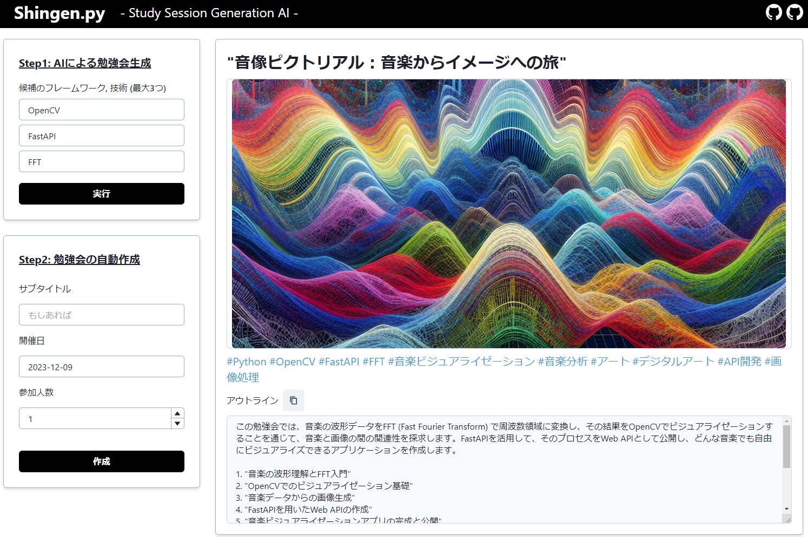

# Yamanashi AIハッカソン 2023

Yamanashi AIハッカソン 2023でチームShingen.pyが作った生成AIベースの
アプリケーションを表示するためのフロンエンドアプリです。

勉強会のタイトル/ロゴ/アウトラインを自動生成しアイデア出しや勉強会の開催・運営を
サポートします

### Node.JSをインストール

```shell
sudo apt-get update
sudo apt-get install -y ca-certificates curl gnupg
sudo mkdir -p /etc/apt/keyrings
curl -fsSL https://deb.nodesource.com/gpgkey/nodesource-repo.gpg.key | sudo gpg --dearmor -o /etc/apt/keyrings/nodesource.gpg

NODE_MAJOR=20
echo "deb [signed-by=/etc/apt/keyrings/nodesource.gpg] https://deb.nodesource.com/node_$NODE_MAJOR.x nodistro main" | sudo tee /etc/apt/sources.list.d/nodesource.list

sudo apt-get update
sudo apt-get install nodejs -y
```

### Yarnのインストール

```shell
curl -sS https://dl.yarnpkg.com/debian/pubkey.gpg | sudo apt-key add -
echo "deb https://dl.yarnpkg.com/debian/ stable main" | sudo tee /etc/apt/sources.list.d/yarn.list
sudo apt update
``````

### モジュールのインストール

```shell
yarn install
```

### 起動 (デバッグ)

```shell
yarn dev
```

### ビルドと起動

```shell
yarn build
npx serve@latest out
```


